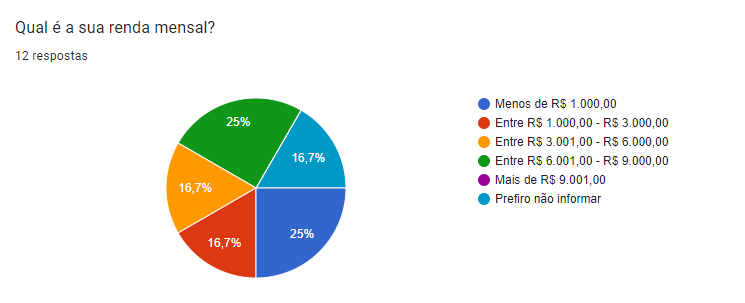
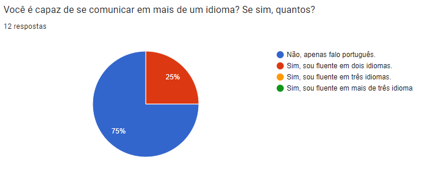
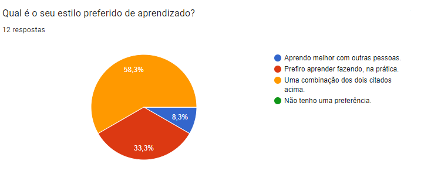
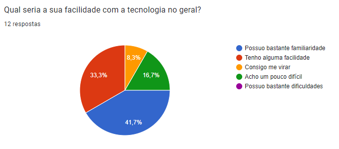
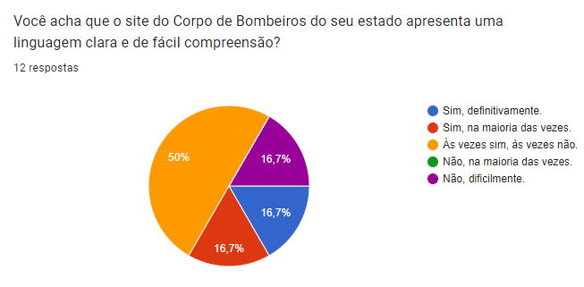

## Introdução
No desenvolvimento de um produto de qualidade, compreender quem são os seus usuários é a atividade mais essencial (Courage e Baxter, 2005; Hackos e Redish, 1998). Nesse contexto, a análise do perfil dos usuários desempenha um papel crucial. Por meio dessa investigação, podemos documentar e compreender o que os usuários reais ou potenciais realmente precisam. A seguir, apresentamos o processo de identificação do perfil dos usuários para o projeto, explorando as técnicas utilizadas e os insights obtidos ao longo do processo.

## Metodologia
A construção do perfil de usuário do Corpo de Bombeiros envolveu a aplicação de duas técnicas distintas: aplicação de questionários e grupo de foco. A seguir, descreveremos cada uma dessas abordagens e como as implementamos.

### Questionários
Um questionário é composto por uma série de perguntas, geralmente disponibilizado em versão impressa ou online, que tem como objetivo coletar informações essenciais por meio das respostas fornecidas pelos participantes.

Para construir o questionário utilizado, elaboramos um total de x questões, abordando diversos aspectos relacionados ao próprio usuário e sua interação com a tecnologia. O questionário foi distribuído para uma ampla variedade de públicos, considerando que o site em questão é acessível a todos os cidadãos. Essa abordagem visou obter uma amostra diversificada e representativa, com o objetivo de garantir a maior riqueza de dados possíveis.

### Vantagens
- Analisar os dados coletados pode ser relativamente mais fácil e rápido;
- É uma técnica econômica, pois requer pouco esforço de distribuição;
- Permite obter informações de um grande número de pessoas de forma mais prática;
- São úteis quando o público-alvo está espalhado em áreas geográficas distintas.

### Desvantagens
- Pode haver uma baixa taxa de resposta;
- É necessário ter cuidado com perguntas que tenham a resposta embutida ou que sejam muito restritivas, pois isso pode fazer com que as pessoas não expressem realmente o que pensam;
- Questões complexas ou que requerem explicações detalhadas podem não ser adequadas para questionários, dificultando a obtenção de informações profundas sobre certos tópicos.

## Resultados coletados
Abaixo estão os resultados obtidos por meio dos questionários realizados. Entre as figuras 1 à 14, temos gráficos que representam as porcentagens atribuídas a cada opção de escolha oferecida em cada pergunta. Além disso, as figuras 15 e 16 apresentam as respostas textuais de acordo com o que foi questionado:

### 1. Faixa etária

Figura 1 - Gráfico (Faixa etária). 

### 2. Gênero

Figura 2 - Gráfico (Gênero). 

### 3. Estado civil

Figura 3 - Gráfico (Estado Civil). 

### 4. Escolaridade

Figura 4 - Gráfico (Escolaridade). 

### 5. Região

Figura 5 - Gráfico (Região). 

### 6. Renda

Figura 6 - Gráfico (Renda) 

### 7. Idiomas

Figura 7 - Gráfico (Idiomas) 

### 8. Estilo de aprendizado

Figura 8 - Gráfico (Estilo preferido de aprendizado) 

### 9. Frequência de leitura

Figura 9 - Gráfico (Frequência de leitura). 

### 10. Facilidade com tecnologia

Figura 10 - Gráfico (Facilidade com Tecnologia). 

### 11. Frequência de uso

Figura 11 - Gráfico (Frequência de uso do site). 

### 12 . Utilização do site

Figura 12 - Gráfico de Faixa etária. 

### 13. Linguagem e clareza

Figura 13 - Gráfico (Clareza da linguagem do site). 

### 14. Ferramentas utilizadas

Figura 14 - Gráfico (Ferramentas do site). 

### 15. Erros no site
Respostas obtidas em relação aos erros encontradas no site:

Figura 15 - Pergunta 1 (Erros) 

 
 ### 16. Sugestões
 Respostas obtidas em relação as sugestões de melhoria do site:

Figura 16 - Pergunta 2 (Sugestões) 

### Grupo de Foco
Um grupo de foco é uma ténica de pesquisa que normalmente reune 3 à 10 pessoas para discutir algum ponto em relação ao projeto. Assim, esses participantes representam o público-alvo do produto e são selecionados pensando em forma de obter diversidade de perspectivas e experiências.

Desta maneira, para realizarmos o grupo de foco foi necessário reunir usuários que compõe o público-alvo em uma entrevista guiada por um moderador que desenvolveu antecipadamente perguntas para conduzir a discussão de forma adequada. 

### Vantagens
- Permite coletar informações de um público-alvo que não conhecemos bem;
- Permite obter perspectivas de diferentes pontos de vistas em pouco tempo;
- A interação frequente entre os participantes pode gerar discussões e ideias.

### Desvantagens
- O recrutamento de usuários que compõe o grupo pode ser uma tarefa complicada que demanda muitos recursos.

### Resultados coletados
Conseguimos reunir três participantes para uma discussão online através do Google Meets, que se estendeu por aproximadamente uma hora e meia no sábado, dia 20 de abril de 2024. As alunas [Bruna Lima](https://github.com/libruna) e [Mariana Letícia](https://github.com/Marianannn) foram as responsáveis de conduzir a sessão. Para iniciar, solicitamos que os participantes navegassem pelo site do Corpo de Bombeiros do Rio de Janeiro e, em seguida, iniciamos alguns questionamentos para capturar suas impressões e feedbacks.

### Perfil dos participantes

|        Nome        |      Sexo      |    Idade    |       Ocupação       |
| ------------------ | -------------- | ----------- | -------------------- | 
| Alexandre Pinheiro |    Masculino   |   51 anos   |   Bombeiro Militar   |
| Darlene Medeiros   |    Feminino    |   44 anos   |   Servidora Pública  |
| Márcio Nogueira    |    Masculino   |   32 anos   |  Produtor de Eventos |

No Grupo de Foco conduzido com os usuários mencionados acima, foram feitas uma série de perguntas, e as respostas dos participantes foram parafraseadas e resumidas para fins de compreensão geral.

- **1. Você considera a organização do conteúdo do site clara e intuitiva? Existem áreas onde você teve dificuldade em encontrar informações específicas?**
    - **Alexandre:** É claro e intuitivo, não tive dificuldades em encontrar conteúdos específicos, exceto informações que necessitam obrigatoriamente de autenticação.
    - **Darlene:** Sim, na página inicial há atalhos para várias opções, o que facilita encontrar as informações dentro site.
    - **Márcio:** Com exceção do risco de eventos, o restante foi bem fácil de encontrar por conta das opções que são exibidas no página inicial, como o início, consultar e contato. Não tive muita dificuldade ao utilizar o site.

- **2. Quais são as principais tarefas que você realiza ao utilizar o site? Existe alguma tarefa que você considere desafiadora ou frustrante?**
    - **Alexandre:** Ver sobre concursos, programas direcionados à comunidade e regulamento interno; no geral, não há dificuldades em navegar e nem barreiras para buscar informações básicas.
    - **Darlene:** No geral, uso para buscar informações gerais relacionadas ao Corpo de Bombeiros; não encontrei nenhuma tarefa desafiadora.
    - **Márcio:** Histórico de incêndio e o nível de periculosidade que pode ocorrer nas áreas; sobre a tarefa desafiadora, é conferir a legislação por falta de uma opção de pesquisa.

- **3. O site oferece alguma funcionalidade que você achou especialmente útil? Existe alguma funcionalidade que você esperava encontrar, mas não estava disponível?**
    - **Alexandre:** Informações sobre concursos e links de acesso rápido a canais úteis.
    - **Darlene:** A opção de "Taxa de Incêndio" e as funcionalidades relacionadas ao requerimento padrão são diferenciais em relação ao site do Corpo de Bombeiros do DF. O site trás certa praticidade, visto que algumas requisições podem ser feitas online.
    - **Márcio:** A emissão de boletos de multa; e gostaria de encontrar o histórico de incêndio, que não existe no site.

- **4. Você encontrou algum problema técnico ao usar o site, como lentidão no carregamento de páginas, incompatibilidade com dispositivos ou navegadores, ou erros de funcionalidade?**
    - **Alexandre:** Não encontrei problemas, o site carrega rapidamente e a princípio não identifiquei erros nas funcionalidades que utilizei.
    - **Darlene:** Quando acessado pelo navegador do celular, o menu principal fecha automaticamente após alguns segundos, o que dificulta a visualização das opções e a navegação pelo site.
    - **Márcio:** Nenhum problema durante o uso.

- **5. Com base em sua experiência com o site, você tem algum feedback específico ou sugestões de melhoria que gostaria de compartilhar?**
    - **Alexandre:** Não há nada em específico a acrescentar, o site é muito bom comparado ao site do Corpo de Bombeiros do DF em algumas funcionalidades.
    - **Darlene:** Fora o que foi citado anteriormente, não tenho sugestões. O que achei bom é que o site disponbiliza muitas funcionalidades e informações.
    - **Márcio:** Melhorias sobre o histórico de incêndio, caixa de pesquisa (tipo de informação que poderia estar na página inicial e que não tem como pesquisar) e as informações sobre os eventos que são difíceis de encontrar.

## Análise dos resultados
Em relação ao perfil do usuário, por meio dos dados obtidos identificamos que os usuários se encaixam predominantemente no gênero feminino no intervalo entre 18 e 24 anos, se concentrando principalmente na região do centro-oeste e possuindo como nível de escolaridade ensino médio, apesar também de terem bastante graduados.

Além disso, identificamos que os usuários possuem bastante ou alguma familiariedade com tecnologia no geral, apesar de não utilizarem o site como costume. Não obstante, os usuários acreditam que o site em alguns momentos não apresenta linguagem clara, assim como pensam conseguir utilizar somente algumas ferramentas do site de forma adequada. 

Desta maneira, podemos descrever as caractéristicas gerais do perfil do usuário como:

#### Definição do Perfil do Usuário
|||
| ------------------ | -------------- |
|    Idade   |   18 e 24 anos   |
|    Gênero    |   Predominantemente feminino   |  
|    Região  |   Centro-oeste   |  
|    Escolaridade  |   Ensino médio   |  
|||

## Bibliografia
> 1. Barbosa, S. D. J.; Silva, B. S. da; Silveira, M. S.; Gasparini, I.; Darin, T.; Barbosa, G. D. J. Interação Humano-Computador e Experiência do usuário. (2021)

## Histórico de Versões

| Versão |    Data    | Descrição                                 | Autor(es)                                       | Revisor(es)                                    |
| ------ | :--------: | ----------------------------------------- | ----------------------------------------------- | ---------------------------------------------- |
| `1.0`   | 16/04/2024 | Criação da página  | [Mariana Letícia](https://github.com/Marianannn) |    [Bruna Lima](https://github.com/libruna)      |
| `1.1`   | 19/04/2024 | Inclusão da introdução e metodologia  |  [Bruna Lima](https://github.com/libruna) |  [Genilson Silva](https://github.com/GenilsonJrs)      | 
| `1.2`   | 22/04/2024 | Inclusão do resultado dos questionários e descrição do grupo de foco |  [Pedro Henrique](https://github.com/PedroHhenriq) |   [Genilson Silva](https://github.com/GenilsonJrs)   |
| `1.3`   | 22/04/2024 | Inclusão dos resultados do grupo de foco |  [Bruna Lima](https://github.com/libruna)  |  [Genilson Silva](https://github.com/GenilsonJrs)  |
| `1.4`   | 06/05/2024 | Inclusão da análise de resultados |  [Pedro Henrique](https://github.com/PedroHhenriq)  | [Genilson Silva](https://github.com/GenilsonJrs)   |
