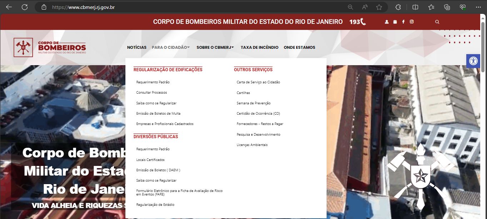
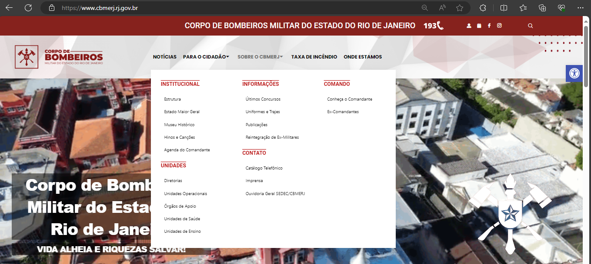
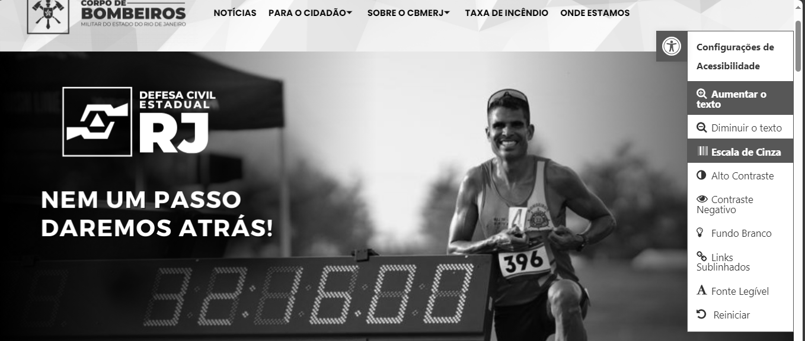
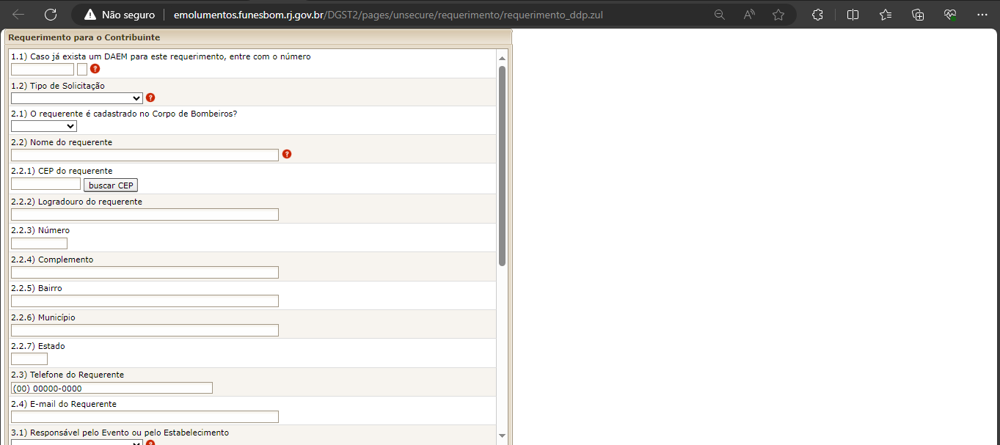
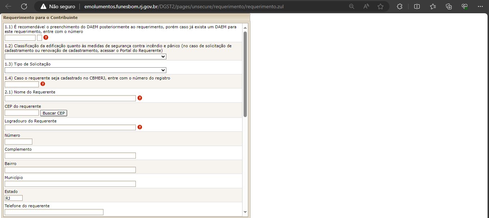
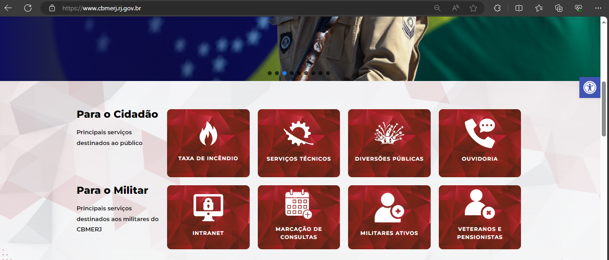
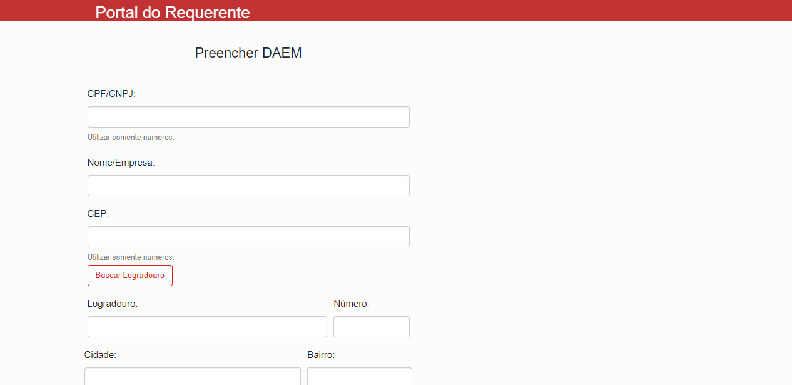

## Introdução
Os princípios e diretrizes gerais orientam o processo de criação de interfaces que sejam intuitivas para os usuários. De acordo com Norman (1988), o design deve simplificar a determinação das ações possíveis em cada momento, utilizando restrições. Além disso, destaca que é importante tornar visíveis as alternativas de ação e seus resultados; avaliar o estado atual do sistema e estabelecer mapeamentos naturais entre intenções, ações e resultados. Os princípios e as diretrizes abrangem os tópicos: correspondência com as expectativas dos usuários, simplicidade nas estruturas das tarefas, equilíbrio entre controle e liberdade do usuário, consistência e padronização, promoção da eficiência do usuário, antecipação das necessidades do usuário, visibilidade e reconhecimento, conteúdo relevante e expressão adequada, e projeto para erros.

## Metodologia
Após revisão dos princípios e diretrizes gerais, realizamos uma análise do site do Corpo de Bombeiros do Rio de Janeiro para determinar quais princípios seriam aplicáveis. Como resultado, identificamos os princípios abaixo, levando em consideração o contexto do sistema e a viabilidade de implementação.

## Princípios aplicáveis

### 1. Correspondência com as expectativas dos usuários
**Definição:** Busca projetar interfaces que estabeleçam padrões familiares e linguagem que os usuários já conhecem. Desta maneira, quando os elementos da interface se alinham com as expectativas dos usuários, a experiência pode se tornar mais intuitiva e previsível.

**Análise:** Ao acessar ao site, conseguimos identificar que ele atende conforme a expectativa do usuário, uma vez que com a função principalmente informativa, apresenta suas inteções e ações possíveis de forma clara. Desta forma, a partir da figura 1 e 1.1 e 1.2, podemos observar que o menu apresenta um ícone com seta para baixo ao lado de menus suspensos com objetivo de orientar ao usuário para que possa escolher suas determinadas opções e apartir delas seguir o seus processos.

Figura  1- Menus (Fonte: Site do Corpo de Bombeiros do Rio de Janeiro).

Figura 1.1 - Menu "Para o Cidadão" (Fonte: Site do Corpo de Bombeiros do Rio de Janeiro).

Figura 1.2 - Menu "Sobre o CBMERJ" (Fonte: Site do Corpo de Bombeiros do Rio de Janeiro).

  
### 2. Simplicidade nas estruturas das tarefas
**Definição:** Envolve simplificar as tarefas e fluxos de trabalho para que os usuários consigam realizar suas atividades de forma direta e sem confusão, uma vez que interfaces complexas podem dificultar a conclusão das tarefas.

**Análise:** Podemos identificar que a estrutura das tarefas realizadas pelo CBMERJ é bem simples, como demonstrado no exemplo da figura 2.1 e 2.2 ao emitir um boleto de multa, podemos executar a maior parte das tarefas simplesmente escolhendo por meio dos menus supensos o que desejamos, sendo redirecionados para um página que já concluí o processo desejado dentro dela mesma ou para uma página que orienta e guia para um outro processo de forma clara. 

Figura 2 - Menu - Emitir Boleto de Multa (Fonte: Site do Corpo de Bombeiros do Rio de Janeiro).

Figura  2.1 - Página - Gerar Boleto (Fonte: Site do Corpo de Bombeiros do Rio de Janeiro).

  
### 3. Equilíbrio entre controle e liberdade do usuário
**Definição:** Busca oferecer opções de controle para usuários, como por exemplo desfazer ações indesejadas, que permitam que eles possam explorar diferentes caminhos. No entanto, ao mesmo tempo que dá maior flexibilidade, não devem sobrecarregar os usuários com muitas opções, mantendo um equilíbrio entre controle e liberdade.

**Análise:** Por conta da estrutura informativa do site, não há muita abertura para o controle do usuário em determinadas tarefas, uma vez que a maior parte das interações serão feitas em pouquíssimos cliques. No entanto, conforme a figura 3 demonstra, por meio do menu suspenso de acessibilidade, o usuário tem opções de controlar alguns aspectos visuais do site que podem auxiliá-lo caso possua alguma dificuldade, podendo assim, ativar, desativar ou reiniciar, assim que deseja. 

Figura  3 - Opções de acessibilidade (Fonte: Site do Corpo de Bombeiros do Rio de Janeiro).

  
### 4. Consistência e padronização
**Definição:** Garante que elementos de interface se comportem da mesma maneira em diferentes partes do sistema, já que isso pode ajudar os usuários a compreender como as coisas funcionam de uma forma melhor e ajudar a reduzir a curva de aprendizado.

**Análise:** Conforme pode ser observado na figura 4, figura 4.1 e figura 4.2, identificamos que o site apresente elementos aparentemente iguais parecem ter propósitos diferentes. Desta maneira, indo ao menu "Para o cidadão" aparecem dois itens com mesmo nome, "Requerimento padrão", sem explicação direito ao usuário, em abas distintas, que levam para páginas com mesmo nome, mas com itens e opções diferentes, o que pode confundir o usuário. 

Figura 4 - Menu "Para Cidadão com Requerimento Padrões" (Fonte: Site do Corpo de Bombeiros do Rio de Janeiro).

Figura 4.1 - "Requerimento Padrão 1" (Fonte: Site do Corpo de Bombeiros do Rio de Janeiro).

Figura 4.2 - "Requerimento Padrão 2" (Fonte: Site do Corpo de Bombeiros do Rio de Janeiro).

  
### 5. Promovendo a eficiência do usuário
**Definição:** Permite que os usuários realizem tarefas rapidamente de forma efetiva, podendo envolver atalhos, sugestões contextuais e otimização de fluxos de trabalho para economizar esforço e tempo.

**Análise:** Por meio da figura, podemos identificar itens que auxiliam ao usuário para que possa otimizar seu tempo. Assim, logo ao entrar na página inicial do site, um pouco abaixo, temos uma sequência de menus com principais serviços destinados tanto ao público quanto aos servidores do CBMERJ que servem como atalhos para sua determinadas páginas. 

Figura 5 - Menu acessível (Fonte: Site do Corpo de Bombeiros do Rio de Janeiro).

  
### 6. Antecipação das necessidades do usuário
**Definição:** Busca prever as necessidades do usuário antes mesmo que ele as expresse, isso envolve fornecer informações e ferramentas relevantes em cada etapa do processo. As estratégias incluem oferecer informações adicionais úteis e lembrar das ações do usuário para facilitar sua execução. A definição cuidadosa de valores padrão também é destacada, considerando que os usuários frequentemente aceitam os padrões sem questionar.

**Análise:** Há recursos que antecipam as necessidades do usuário, prevendo situações comuns. Por exemplo, na figura 6, são oferecidos recursos de ajuda durante o preenchimento de campos, facilitando a compreensão. Além disso, na figura 7, observamos o uso de valores padrão nos campos, o que também contribui para antecipar as ações do usuário.

Figura 6 - Recurso de ajuda em Solicitação de Requimento Padrão (Fonte: Site do Corpo de Bombeiros do Rio de Janeiro).

Figura 7 - Campo default em Solicitação de Requimento Padrão (Fonte: Site do Corpo de Bombeiros do Rio de Janeiro).

### 7. Visibilidade e reconhecimento
**Definição:** Busca tornar claro o que é possível realizar e o estado do sistema antes e após as ações do usuário. As estratégias incluem oferecer feedback adequado e oportuno, manter o usuário informado sobre seu progresso e facilitar a navegação, evitando sobrecarregá-lo com informações desnecessárias.

**Análise:** 
Ao acessar o site, percebemos imediatamente o menu bem estruturado, organizado em seções que facilitam a navegação. Ao escolher uma seção, como exemplificado na Figura 8 com "Emissão de Boletos", o usuário é direcionado diretamente ao formulário correspondente, agilizando a interação. De modo geral, a interface transmite clareza em relação aos estados e ações disponíveis.

Figura 8 - Formulário para Emissão de Boleto (Fonte: Site do Corpo de Bombeiros do Rio de Janeiro).

  
### 8. Conteúdo relevante e expressão adequada
**Definição:** Enfatiza a importância de oferecer informações pertinentes e redigir textos de forma clara e concisa nas interfaces. Isso inclui evitar o excesso de informação, utilizar linguagem simples e direta, além de garantir legibilidade e acessibilidade para todos os usuários. É crucial que o conteúdo apresentado seja relevante para as necessidades dos usuários e que a expressão seja adequada ao contexto da interação.

**Análise:** No geral, o site mantém um padrão consistente durante a navegação, com textos claros que comunicam eficazmente seus propósitos. Um exemplo disso pode ser visto na figura 9, onde os menus estão localizados, apresentando opções organizadas e categorizadas de forma precisa.

Figura 9 - Opções do menu (Fonte: Site do Corpo de Bombeiros do Rio de Janeiro).

Por outro lado, na figura 10, observamos que embora haja opções de acessibilidade, ao selecioná-las, elas se aplicam apenas à página atual. Ao navegar para outras páginas, o site retorna às configurações padrão, o que pode dificultar a experiência de usuários que dependem dessas opções.

Figura 10 - Opções de acessibilidade (Fonte: Site do Corpo de Bombeiros do Rio de Janeiro).

### 9. Projeto para erros
**Definição:** Envolve antecipar e facilitar a recuperação de erros por parte do usuário. isso inclui projetar sistemas exploráveis, onde é fácil reverter operações e difícil realizar ações irreversíveis. Recomenda-se evitar erros sempre que possível e, caso ocorram, o sistema deve detectá-los e oferecer mecanismos simples para tratá-los. As mensagens de erro devem ser claras, indicando o problema e sugerindo uma solução construtiva. Além disso, é importante oferecer ajuda e documentação de alta qualidade para esclarecer dúvidas dos usuários durante a interação.

**Análise:** Ao tentar imprimir o requerimento padrão sem preencher alguns campos, um aviso de erro é exibido. No entanto, a mensagem sobre o motivo do erro não é clara, apenas uma mensagem de erro interno do sistema é exibida na tela sem que seja previamente tratada para compreensão do usuário, como mostrado na figura 11.

Figura 11 - Erro ao imprimir Requerimento Padrão (Fonte: Site do Corpo de Bombeiros do Rio de Janeiro).

## Bibliografia
> 1. Barbosa, S. D. J.; Silva, B. S. da; Silveira, M. S.; Gasparini, I.; Darin, T.; Barbosa, G. D. J. Interação Humano-Computador e Experiência do usuário. (2021)

## Histórico de Versões

| Versão |    Data    | Descrição                                 | Autor(es)                                       | Revisor(es)                                    |
| ------ | :--------: | ----------------------------------------- | ----------------------------------------------- | ---------------------------------------------- |
| `1.0`   | 07/05/2024 | Criação da página                         | [Mariana Letícia](https://github.com/Marianannn) |   [Bruna Lima](https://github.com/libruna)  |
| `1.1`   | 11/05/2024 | Adição da introdução e metodologia        | [Bruna Lima](https://github.com/libruna)         |      |
| `1.2`   | 12/05/2024 | Adição dos princícios                     | [Bruna Lima](https://github.com/libruna)         |      |
| `1.3`   | 13/05/2024 | Adição de outros princípios                    | [Pedro Henrique](https://github.com/PedroHhenriq)         |      |
