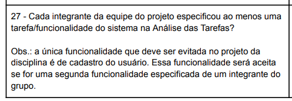

## Introdução
Revisar os itens de um projeto é uma tarefa dinâmica e pode ser trabalhosa pela necessidade de analisar algum projeto, encontrar erros, e até sugerir melhorias.

A partir disso, se é capaz de fazer uma verificação da análise de tarefas de modo a compreender essa seção do projeto e garantir essa melhoria.

## Metodologia
Através do que foi descrito anteriormente no [planejamento de verificação](../planejamento_verificacao.md), a metodologia a ser utilizada é a inspeção por percurso cognitivo, com o objetivo de analisar e encontrar problemas na interface a partir da exploração dela. (1)

A seguir, primeiramente evidenciaremos os participantes dessa lista de revisão, o template de tópicos a ser analisados durante a avaliação, e a tabela 1 descrevendo os problemas encontrados e suas especificações.

### Participantes
A **avaliadora** responsável por desenvolver a lista de verificação da etapa 2 sobre a análise de tarefas para o grupo 8 será a [Mariana Letícia](https://github.com/Marianannn), e os **revisores** serão [Bruna Lima](https://github.com/libruna), [Daniela Alarcão](https://github.com/danialarcao), [Lucas Avelar](https://github.com/LucasAvelar2711) e  [Pedro Henrique](https://github.com/PedroHhenriq), conforme está evidente em [planejamento de verificação](../planejamento_verificacao.md). Todos do grupo, menos a pessoa responsável por fazer o checklist, serão encarregados de avaliar cada um dos cenários.

### Template de Checklist: Análise de tarefas

- **Item 1:** A análise de tarefas está presente no documento, segundo a figura 1 a seguir?
    - **Fonte:** disponível no canal do telegram da disciplina - IHC Turma 1 (1/2024) - Prof. André (2).
    - **Imagem:**
     

    

    

    

    
Figura 1: Pergunta sobre a existência do documento no projeto

- **Item 2:** Há no mínimo duas técnicas para especificar as tarefas? Por exemplo: HTA, GOMS ou CTT, como está descrito na figura 2 logo abaixo?
    - **Fonte:** disponível no canal do telegram da disciplina - IHC Turma 1 (1/2024) - Prof. André (2).
    - **Imagem:**
     

    

    

    

    
Figura 2: exigência da análise de tarefas ser feita com mais de uma técnica.

- **Item 3:** Os diagramas HTA propostos seguem a notação da técnica, segundo a figura 3 a seguir?
    - **Fonte:** disponível no canal do telegram da disciplina - IHC Turma 1 (1/2024) - Prof. André (2).
    - **Imagem:**
     

    

    

    

    
Figura 3: Pergunta sobre a existência de notação técnica

- **Item 4:** Cada integrante do grupo analisou pelo menos uma funcionalidade, conforme está descrito na figura 4 a seguir?
    - **Fonte:**  disponível no canal do telegram da disciplina - IHC Turma 1 (1/2024) - Prof. André (2)
    - **Imagem:**
     

    

    

    

    
Figura 4: Exigência de uma tarefa analisada por integrante

- **Item 5:** A análise de tarefas possui um conjunto de objetivos que correspondem ao objetivo das pessoas que utilizarão aquele sistema, além de uma lista de ações correspondentes ao objetivos, conforme é evidenciado na figura 5 a seguir?
    - **Fonte:** Barbosa, Simone D. J. et al. Interação Humano-Computador e Experiência do Usuário. Autopublicação, 2021, p. 178. (3)
    - **Imagem:**
     

    

    

    

    
Figura 5: Evidência da necessidade de objetivos e listas para a análise de tarefas

## Resultado do Checklist

### Funcionalidade:  - Revisor:
### Funcionalidade:  - Revisor: 
### Funcionalidade:  - Revisor:
### Funcionalidade:  - Revisor:
### Funcionalidade:  - Revisor: 

### Funcionalidade: Comprar passagem - Revisora: Bruna Lima

 

| Item | Descrição      | Versão do Artefato | Avaliação      | Descrição do problema | Sugestão de Ação Corretiva | Observações |
| ---- | -------------- | ------------------ | -------------- | --------------------- | -------------------------- | ----------- |
|  1   | A análise de tarefas está presente no documento? | 1.0 | Conforme | | | |
|  2   | Há no mínimo duas técnicas para especificar as tarefas? | 1.0 | Conforme | | | Foram utilizadas as técnicas: HTA e GOMS. |
|  3   | Os diagramas HTA propostos seguem a notação da técnica? | 1.0 | Conforme | | | Sim, as notações foram aplicadas corretamente. | 
|  4   | Cada integrante do grupo analisou pelo menos uma funcionalidade? | 1.0 | Conforme | | |
|  5   | A análise de tarefas possui um conjunto de objetivos que correspondem ao objetivo das pessoas que utilizarão aquele sistema, além de uma lista de ações correspondentes ao objetivos? | 1.0 | Conforme | | | Os objetivos e ações foram bem definidos. |

Tabela 1: Checklist de verificação dos Aspectos Éticos.

Fonte: Bruna Lima, 2024

## Conclusão

## Biografia
>- Barbosa, E. F., & Souza, S. R. S. (2017). Inspeção de Software. Instituto de Ciências Matemáticas e de Computação — ICMC/USP. Disponivel em: https://edisciplinas.usp.br/pluginfile.php/5306452/mod_resource/content/0/Aula02-Inspecao.pdf
>- Serrano, M., & Serrano, M. (2017). Requisitos – Aula 23. Disponivel em: https://aprender3.unb.br/pluginfile.php/2843809/mod_resource/content/2/Requisitos%20-%20Aula%20023.pdf
>- Ministério da Agricultura, Pecuária e Abastecimento. (2023). Lista de Verificação da Qualidade de Artefatos - Checklist Ágil. Disponivel em: https://www.gov.br/agricultura/pt-br/acesso-a-informacao/licitacoes-e-contratos/edital/2019/pregao-eletronico-no-05-2018/diretrizes/lista-de-verificacao-da-qualidade-de-artefatos-checklist-agil.xls/view

## Referências Bibliográficas
> 1. Barbosa, Simone D. J. et al. Interação Humano-Computador e Experiência do Usuário. Autopublicação, 2021, p. 286.
> 2. Barros, A., & Aires, M. B. (2024). Entrega da apresentação do projeto etapa 2: Perfil do usuário, Aspectos Éticos de Pesquisas Envolvendo Pessoas, Personas e Análise de tarefas. [Documento PDF].
> 3. Barbosa, Simone D. J. et al. Interação Humano-Computador e Experiência do Usuário. Autopublicação, 2021, p. 178.

## Histórico de Versões

| Versão |    Data    | Descrição                                 | Autor(es)                                       | Revisor(es)                                    |
| ------ | :--------: | ----------------------------------------- | ----------------------------------------------- | ---------------------------------------------- |
| `1.0`   | 11/06/2024 | Criação da página                         | [Mariana Letícia](https://github.com/Marianannn) |   |
| `2.0`   | 11/06/2024 | adição do checklist                         | [Mariana Letícia](https://github.com/Marianannn) |   |