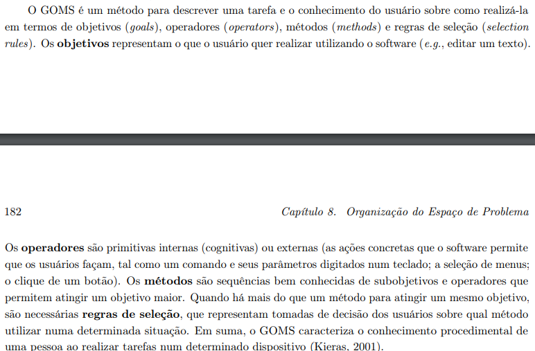
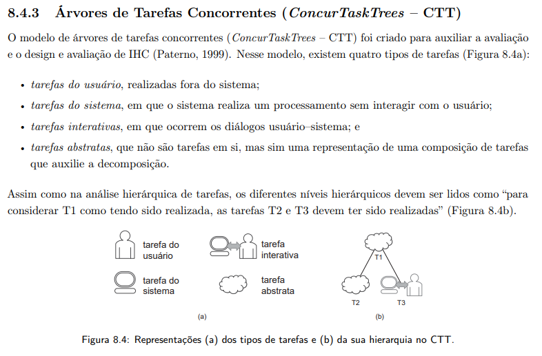

## Introdução
Revisar os itens de um projeto é uma tarefa dinâmica e pode ser trabalhosa pela necessidade de analisar algum projeto, encontrar erros, e até sugerir melhorias.

A partir disso, se é capaz de fazer uma verificação da análise de tarefas de modo a compreender essa seção do projeto e garantir essa melhoria.

## Metodologia
Através do que foi descrito anteriormente no [planejamento de verificação](../planejamento_verificacao.md), a metodologia a ser utilizada é a inspeção, com o objetivo de analisar e encontrar problemas na interface a partir da exploração dela. (1)

A seguir, evidenciaremos: os participantes dessa lista de revisão; o template de tópicos a ser analisados durante a avaliação; e as tabelas de 1 a 6 descrevendo os resutados das verificações de análise de tarefas das checklists.

### Participantes
A **avaliadora** responsável por desenvolver a lista de verificação da etapa 2 sobre a análise de tarefas para o grupo 7 será a [Mariana Letícia](https://github.com/Marianannn), e os **revisores** serão [Bruna Lima](https://github.com/libruna), [Daniela Alarcão](https://github.com/danialarcao), [Lucas Avelar](https://github.com/LucasAvelar2711) e  [Pedro Henrique](https://github.com/PedroHhenriq), conforme está evidente em [planejamento de verificação](../planejamento_verificacao.md). 

### Checklist: Análise de tarefas

- **Item 1:** A análise de tarefas possui um conjunto de objetivos que correspondem ao objetivo das pessoas que utilizarão aquele sistema, além de uma lista de ações correspondentes ao objetivos, conforme é evidenciado na figura 1 a seguir? Esse objetivo também é representado pelo primeiro passo de execução de um HTA na figura 2.
    - **Fonte:** Barbosa, Simone D. J. et al. Interação Humano-Computador e Experiência do Usuário. Autopublicação, 2021, p. 178.  &
    Barbosa, Simone D. J. et al. Interação Humano-Computador e Experiência do Usuário. Autopublicação, 2021, p. 180.
    - **Imagem:**
     

    

    
      
    

    

    
Figura 1 e 2: Evidência da necessidade de objetivos e listas para a análise de tarefas

- **Item 2:** foram implementados o segundo passo da execução de um HTA sendo ele: estabelecer uma ligação lógica entre os objetivos e as medidas de sucesso, mencionando quais seriam essas medidas de sucesso como está descrito na figura 3 a seguir?
    - **Fonte:**  Barbosa, Simone D. J. et al. Interação Humano-Computador e Experiência do Usuário. Autopublicação, 2021, p. 180.
    - **Imagem:** 
     

    

    

    

    
Figura 3: Passos 2 do HTA segundo o livro mencionado acima

- **Item 3:** foram implementados os passos 3 e 4 do HTA, sendo o 3 se o HTA possui dados verossímeis que condizem com a funcionalidade analisada, e o 4 se houve uma decomposição de objetivos em subobjetivos em um diagrama ou tabela hierárquica contendo ações, feedbacks disparadas a partir dos objetivos como está descrito na figura 4 a seguir?
    - **Fonte:**  Barbosa, Simone D. J. et al. Interação Humano-Computador e Experiência do Usuário. Autopublicação, 2021, p. 181.
    - **Imagem:** 
     

    

    

    

    
Figura 4: Passos 3 e 4 do HTA segundo o livro mencionado acima

- **Item 4:** Segundo os passo 5, os dados foram coletados de usuários reais, garantindo a confiabilidade da análise como está descrito na figura 5 a seguir?
    - **Fonte:**  Barbosa, Simone D. J. et al. Interação Humano-Computador e Experiência do Usuário. Autopublicação, 2021, p. 181.
    - **Imagem:** 
     

    

    

    

    
Figura 5: Passo 5 do HTA segundo o livro mencionado acima

- **Item 5:** Segundo os passo 6, as operações se apresentam como significativas e de acordo com os objetivos como está descrito na figura 6 a seguir?
    - **Fonte:**  Barbosa, Simone D. J. et al. Interação Humano-Computador e Experiência do Usuário. Autopublicação, 2021, p. 181.
    - **Imagem:** 
     

    

    

    

    
Figura 6: Passo 6 do HTA segundo o livro mencionado acima

- **Item 6:** Segundo os passo 7, foram considerados erros humanos, e foram representados os diagramas como está descrito na figura 7 a seguir? 
    - **Fonte:**  Barbosa, Simone D. J. et al. Interação Humano-Computador e Experiência do Usuário. Autopublicação, 2021, p. 181.
    - **Imagem:** 
     

    

    

    

    
Figura 7: Passos 6 do HTA segundo o livro mencionado acima

- **Item 7:** Caso a análise tenha sido representada o HTA como uma das análises de tarefa, foram utilizados corretamente elementos como plano e operações - feedback, input etc. e uso correto das representações de elementos visuais do HTA tais como está ilustrado abaixo como está descrito na figura 8 a seguir? 
    - **Fonte:**  Barbosa, Simone D. J. et al. Interação Humano-Computador e Experiência do Usuário. Autopublicação, 2021, p. 178.
    - **Imagem:** 
     

    

    

    

    
Figura 8: Uso correto do HTA

- **Item 8:** Caso a análise tenha sido representada pelo GOMS, está descrito os objetivos, operadores, métodos e regras de seleção, assim como está descrito na figura 9 a seguir?
    - **Fonte:**  Barbosa, Simone D. J. et al. Interação Humano-Computador e Experiência do Usuário. Autopublicação, 2021, p. 182.
    - **Imagem:** 
     

    

    

    

    
Figura 9: Uso correto do GOMS

- **Item 9:** Caso a análise tenha sido representada pela Árvore de tarefas Concorrentes(CTT), foram representados corretamente as tarefas de usuário, sistema, iterativas e abstradas, como está conforma na figura 10 a seguir?
    - **Fonte:**  Barbosa, Simone D. J. et al. Interação Humano-Computador e Experiência do Usuário. Autopublicação, 2021, p. 187.
    - **Imagem:** 
     

    

    

    

    
Figura 10: Uso correto dos elementos do CTT

- **Item 10:** Caso a análise tenha sido representada pela Árvore de tarefas Concorrentes(CTT), foram representados corretamente as relações entre elementos, como a ativação, ativação com passagem de informação, escolha, tarefas concorrentes, tarefas concorrentes e comunicantes, tarefas independentes, desativação e suspensão/retomada, como está evidente na figura 11 a seguir?
    - **Fonte:**  Barbosa, Simone D. J. et al. Interação Humano-Computador e Experiência do Usuário. Autopublicação, 2021, p. 188.
    - **Imagem:** 
     

    

    

    

    
Figura 11: Uso correto das relações do CTT

## Resultado do Checklist
 <!-- template de VERIFICAÇÃO -->

<!-- ### Funcionalidade : (COLOCAR O NOME DA FUNCIONALIDADE AQUI) - Revisor: C(OLOCAR NOME DO REVISOR AQUI)
| Item | Descrição      | Versão do Artefato | Avaliação      | Descrição do problema | Sugestão de Ação Corretiva | Observações |
| ---- | -------------- | ------------------ | -------------- | --------------------- | -------------------------- | ----------- |
|  1   | (COLOCAR DECRIÇÃO DO ITEM 1 AQUI) | (COLOCAR SE ESTÁ CONFORME OU NÃO CONFORME) |  | |
|  2   | (COLOCAR DECRIÇÃO DO ITEM 2 AQUI) | (COLOCAR VERSÃO AQUI) | (COLOCAR SE ESTÁ CONFORME OU NÃO CONFORME)|  |   |  |
|  3   | (COLOCAR DECRIÇÃO DO ITEM 3 AQUI) | (COLOCAR VERSÃO AQUI)| (COLOCAR SE ESTÁ CONFORME OU NÃO CONFORME) | |  | 
|  4   | (COLOCAR DECRIÇÃO DO ITEM 4 AQUI) | (COLOCAR VERSÃO AQUI) | (COLOCAR SE ESTÁ CONFORME OU NÃO CONFORME)  | | | |
|  5   | (COLOCAR DECRIÇÃO DO ITEM 5 AQUI) | (COLOCAR VERSÃO AQUI)| (COLOCAR SE ESTÁ CONFORME OU NÃO CONFORME)  | | |  |

Tabela (COLQUE O NUMERO DA TABELA AQUI): (COLOQUE O TÍTULO DA TABELA AQUI)

Fonte: (COLOQUE SEU NOME AQUI), 2024

<iframe width="560" height="315" 
src="(COLOQUE O LINK EMBED AQUI)" 
title="YouTube video player" frameborder="0" allow="accelerometer; autoplay; clipboard-write; encrypted-media; gyroscope; picture-in-picture; web-share" referrerpolicy="strict-origin-when-cross-origin" allowfullscreen></iframe>

Vídeo (COLOQUE O NUMERO DO VÍDEO AQUI): (COLOQUE O TÍTULO DO VÍDEO AQUI).

Fonte: (COLOQUE SEU NOME AQUI), 2024
 -->

## Conclusão

## Biografia
>- Barbosa, E. F., & Souza, S. R. S. (2017). Inspeção de Software. Instituto de Ciências Matemáticas e de Computação — ICMC/USP. Disponivel em: https://edisciplinas.usp.br/pluginfile.php/5306452/mod_resource/content/0/Aula02-Inspecao.pdf

## Referências Bibliográficas
> 1. Barbosa, Simone D. J. et al. Interação Humano-Computador e Experiência do Usuário. Autopublicação, 2021, p. 286.

## Histórico de Versões

| Versão |    Data    | Descrição                                 | Autor(es)                                       | Revisor(es)                                    |
| ------ | :--------: | ----------------------------------------- | ----------------------------------------------- | ---------------------------------------------- |
| `1.0`   | 13/06/2024 | Criação da página                         | [Mariana Letícia](https://github.com/Marianannn) |   |
| `2.0`   | 22/06/2024 | Adição do template de checklist a ser verificado                          | [Mariana Letícia](https://github.com/Marianannn) |   |
